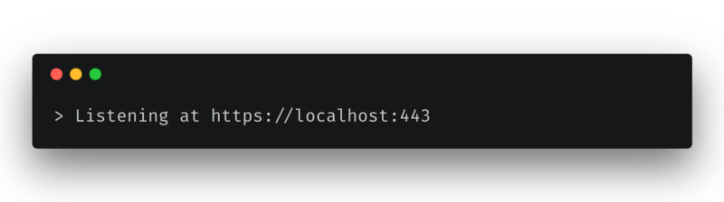
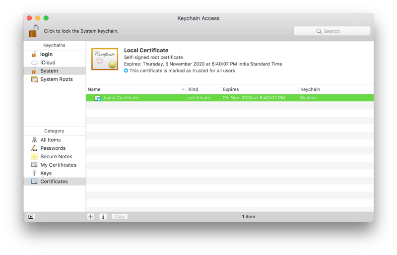
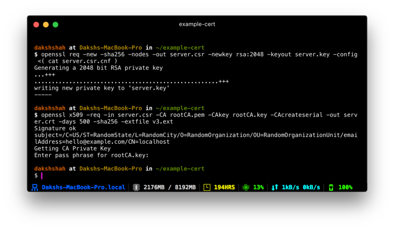
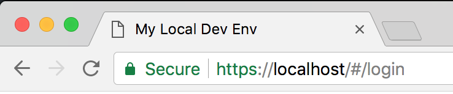

_This article was originally written for [freeCodeCamp.org](https://medium.com/free-code-camp/how-to-get-https-working-on-your-local-development-environment-in-5-minutes-7af615770eec)._

Almost any website you visit today is protected by HTTPS. If yours isn’t yet, [it should be](https://developers.google.com/web/fundamentals/security/encrypt-in-transit/why-https). Securing your server with HTTPS also means that you can’t send requests to this server from one that isn’t protected by HTTPS. This poses a problem for developers who use a local development environment because all of them run on `http://localhost` out-of-the-box.



At the startup I’m a part of, we decided to secure our AWS Elastic Load Balancer endpoints with HTTPS as part of a move to enhance security. I ran into a situation where my local development environment’s requests to the server started getting rejected.

A quick Google search later, I found several articles like [this](https://devcenter.heroku.com/articles/ssl-certificate-self), [this](https://www.kevinleary.net/self-signed-trusted-certificates-node-js-express-js/) or [this one](https://blog.praveen.science/securing-your-localhost/) with detailed instructions on how I could implement HTTPS on `localhost`. None of these instructions seemed to work even after I followed them religiously. Chrome always threw a `NET::ERR_CERT_COMMON_NAME_INVALID` error at me.


## The problem

All the detailed instructions I had found were correct for the time they were written. Not anymore.

After a ton of Googling, I discovered that the reason for my local certificate getting rejected was that [Chrome had deprecated support for commonName matching in certificates](https://groups.google.com/a/chromium.org/forum/m/#!topic/security-dev/IGT2fLJrAeo), in effect, requiring a subjectAltName since January 2017.

## The solution

We’ll be using [OpenSSL](https://www.openssl.org/) to generate all of our certificates.

### Step 1: Root SSL certificate

The first step is to create a Root Secure Sockets Layer (SSL) certificate. This root certificate can then be used to sign any number of certificates you might generate for individual domains. If you aren’t familiar with the SSL ecosystem, [this article from DNSimple](https://support.dnsimple.com/articles/what-is-ssl-root-certificate/) does a good job of introducing Root SSL certificates.

Generate a RSA-2048 key and save it to a file `rootCA.key`. This file will be used as the key to generate the Root SSL certificate. You will be prompted for a pass phrase which you’ll need to enter each time you use this particular key to generate a certificate.

```bash
openssl genrsa -des3 -out rootCA.key 2048
```

You can use the key you generated to create a new Root SSL certificate. Save it to a file named `rootCA.pem`. This certificate will have a validity of 1,024 days. Feel free to change it to any number of days you want. You’ll also be prompted for other optional information.

```bash
openssl req -x509 -new -nodes -key rootCA.key -sha256 -days 1024 -out rootCA.pem
```

### Step 2: Trust the root SSL certificate

Before you can use the newly created Root SSL certificate to start issuing domain certificates, there’s one more step. You need to to tell your Mac to trust your root certificate so all individual certificates issued by it are also trusted.

Open Keychain Access on your Mac and go to the Certificates category in your System keychain. Once there, import the `rootCA.pem` using File > Import Items. Double click the imported certificate and change the “When using this certificate:” dropdown to **Always Trust** in the Trust section.

Your certificate should look something like this inside Keychain Access if you’ve correctly followed the instructions till now.



### Step 3: Domain SSL certificate

The root SSL certificate can now be used to issue a certificate specifically for your local development environment located at `localhost`.

Create a new OpenSSL configuration file `server.csr.cnf` so you can import these settings when creating a certificate instead of entering them on the command line.

<div class="filename">server.csr.cnf</div>

```
[req]
default_bits = 2048
prompt = no
default_md = sha256
distinguished_name = dn

[dn]
C=US
ST=RandomState
L=RandomCity
O=RandomOrganization
OU=RandomOrganizationUnit
emailAddress=hello@example.com
CN = localhost
```

Create a `v3.ext` file in order to create a [X509 v3 certificate](https://en.wikipedia.org/wiki/X.509). Notice how we’re specifying `subjectAltName` here.

<div class="filename">v3.ext</div>

```
authorityKeyIdentifier=keyid,issuer
basicConstraints=CA:FALSE
keyUsage = digitalSignature, nonRepudiation, keyEncipherment, dataEncipherment
subjectAltName = @alt_names

[alt_names]
DNS.1 = localhost
```

Create a certificate key for `localhost` using the configuration settings stored in `server.csr.cnf`. This key is stored in `server.key`.

```bash
openssl req -new -sha256 -nodes -out server.csr -newkey rsa:2048 -keyout server.key -config <( cat server.csr.cnf )
```

A certificate signing request is issued via the root SSL certificate we created earlier to create a domain certificate for `localhost`. The output is a certificate file called `server.crt`.

```bash
openssl x509 -req -in server.csr -CA rootCA.pem -CAkey rootCA.key -CAcreateserial -out server.crt -days 500 -sha256 -extfile v3.ext
```



## Use your new SSL certificate

You’re now ready to secure your `localhost` with HTTPS. Move the `server.key` and `server.crt` files to an accessible location on your server and include them when starting your server.

In an Express app written in Node.js, here’s how you would do it. Make sure you do this only for your local environment. **Do not use this in production**.



I hope you found this tutorial useful. If you’re not comfortable with running the commands given here by yourself, I’ve created a set of handy scripts you can run quickly to generate the certificates for you. More details can be found on the [local-cert-generator GitHub repo](https://github.com/dakshshah96/local-cert-generator/).
